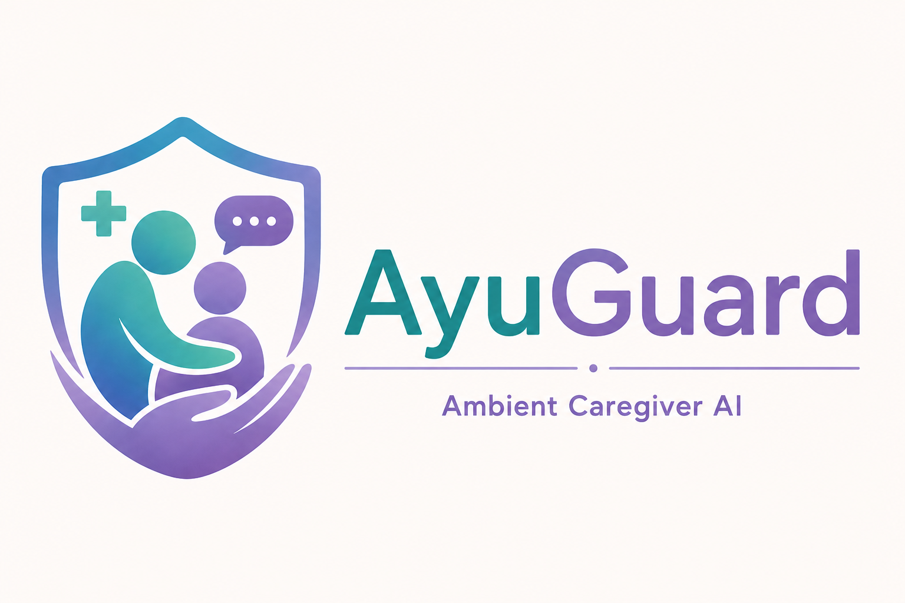

<p align="center">
  
</p>

<h1 align="center">AyuGuard — Ambient Multi-Agent Caregiver Platform</h1>

<p align="center">
  <em>Early warning signals for disease progression, powered by real clinical datasets and Google ADK.</em>
</p>

<p align="center">
  <a href="https://ayuguard-ui-118454190848.asia-south1.run.app"><strong>🌐 Live Demo →</strong></a>
</p>

---

## What is AyuGuard?

AyuGuard (आयुगार्ड) is an ambient multi-agent caregiver assistant for family caregivers looking after elderly or chronically ill patients.

**The core insight:** Caregivers answer individual questions one at a time — "is this headache serious?", "is this okay with his diabetes?" Each question looks mild. A reactive chatbot almost always says "monitor it." But the real risk lives in **patterns across days and weeks** — mild fatigue + increased thirst + blurry vision over 10 days is a classic early metabolic warning sign. No caregiver has the bandwidth to track and cross-reference sparse, irregular observations manually.

That is AyuGuard's job.

---

## 🚀 Live Deployment (Google Cloud Run)

| Service | URL |
|---------|-----|
| 🌐 UI (Caregiver Dashboard) | https://ayuguard-ui-118454190848.asia-south1.run.app |
| 🤖 ADK Agent API | https://ayuguard-agent-118454190848.asia-south1.run.app |

- **Region:** `asia-south1` (Mumbai)
- **Project:** `silken-dogfish-484814-g9`
- **Infrastructure:** Google Cloud Run (fully managed, serverless)

---

## ✨ Features

### 🧑‍⚕️ Caregiver Chat
- Describe symptoms in **English, Hindi, or Hinglish** — AyuGuard understands all three
- Multi-agent pipeline: extracts, scores, and responds to every observation
- Warm, non-clinical tone

### 📊 Health Dashboard
- **Urgency Ring** — visual composite risk score (0–100)
- **14-Day Symptom Timeline** — chronological view of all logged symptoms
- **Symptom Frequency Bars** — most-recurring symptoms
- **Pattern Insight** — AI-generated summary of the symptom pattern
- **Disease Match** — closest match from the 4,921-row clinical dataset
- **Recommended Precautions** — dataset-sourced home-care steps
- **Care Plan** — meal, medication and activity plan set by caregiver

### 🧓 Patient Chat
- Separate patient-facing interface with calming tone
- Caregiver notifications appear as gentle in-app cards

### 🗂️ Medical Records (Gemini AI)
- Upload **PDFs, JPGs, PNGs** (lab reports, prescriptions, discharge summaries)
- Gemini AI extracts key findings and abnormal values automatically
- Cross-report **abnormal parameter tracker**
- Stored in **Google Cloud Storage** (Cloud Run) or local filesystem (dev)

### 🔔 Notifications
- Caregiver sends care-plan updates; patient sees them as calm in-app cards
- Unread badge counter + notification panel

---

## Architecture

```
Caregiver / Patient Input
         │
         ▼
 FastAPI UI Server  (port 8001 / 8080 on Cloud Run)
 Serves SPA + /api/* data endpoints + SSE proxy to ADK
         │
         ▼
 ayuguard_orchestrator  (Google ADK, gemini-2.5-flash)
         │
         ├── AgentTool: symptom_extraction_agent
         │     Converts free text (Hindi/English/Hinglish) → structured JSON
         │
         ├── Tool: store_symptom_log()
         │     Persists to JSON / Firestore
         │
         ├── Tool: compute_trend_score()   ← DETERMINISTIC (no LLM)
         │     14-day decay window + Jaccard dataset search
         │     urgency = similarity×0.5 + persistence×0.3 + severity×0.2
         │
         ├── AgentTool: condition_retrieval_agent  (if watch/escalate)
         │     Searches 4,921-row clinical dataset
         │
         └── AgentTool: caregiver_communication_agent
               Warm, localized message — NEVER diagnoses
```

### The Safety Rule
> **The LLM never decides what is dangerous. The deterministic scoring formula decides that. The LLM only explains it.**

---

## Urgency Formula

```
composite = similarity          × 0.50
          + (persistence_days / 14) × 0.30
          + (avg_severity / 3)      × 0.20

composite ≥ 0.65  →  "escalate"  (pattern worth a doctor visit)
composite ≥ 0.42  →  "watch"     (pattern emerging, monitor closely)
composite <  0.42  →  "low"       (log saved, nothing to flag yet)
```

**48-hour cooldown** per `(patient, disease)` pair prevents alert fatigue.

---

## Real Clinical Datasets Used

| File | Size | What it provides |
|---|---|---|
| `datasets/dataset.csv` | 4,921 rows, 41 diseases | Disease → symptom clusters |
| `datasets/Symptom-severity.csv` | 133 symptoms | Clinical severity weights 1–7 |
| `datasets/symptom_Description.csv` | 41 diseases | Plain-language disease descriptions |
| `datasets/symptom_precaution.csv` | 41 diseases | Up to 4 actionable precautions |
| `datasets/Symptom2Disease.csv` | 1,200 rows | NLP text → disease |

---

## Project Structure

```
ayuguard-care-platform/
├── ayuguard/                        ← ADK agent package
│   ├── agent.py                     ← root_agent orchestrator (gemini-2.5-flash)
│   ├── .env                         ← GOOGLE_API_KEY (not committed)
│   ├── data/
│   │   ├── symptom_logs.json        ← rolling patient log store
│   │   ├── care_plan.json           ← active care plan
│   │   ├── notifications.json       ← caregiver → patient notifications
│   │   └── medical_records.json     ← uploaded document metadata + AI analysis
│   ├── tools/
│   │   ├── dataset_search.py        ← weighted Jaccard search
│   │   ├── symptom_store.py         ← persistence layer
│   │   ├── trend_window.py          ← 14-day decay window
│   │   ├── urgency_scorer.py        ← deterministic scoring (NO LLM)
│   │   ├── care_plan.py             ← care plan + notifications
│   │   ├── patient_profile.py       ← patient/caregiver profile
│   │   └── medical_records.py       ← Gemini AI document analysis + GCS
│   └── sub_agents/
│       ├── extraction.py            ← symptom_extraction_agent
│       ├── retrieval.py             ← condition_retrieval_agent
│       └── communication.py        ← caregiver_communication_agent
├── ui/
│   ├── index.html                   ← Single Page Application (SPA)
│   ├── server.py                    ← FastAPI UI server
│   └── static/
│       └── Logo.png                 ← AyuGuard brand logo
├── datasets/                        ← Real clinical CSV datasets
├── Dockerfile.agent                 ← Cloud Run: ADK agent container
├── Dockerfile.ui                    ← Cloud Run: UI server container
├── deploy.ps1                       ← One-click Cloud Run deployment
└── requirements.txt
```

---

## Quick Start (Local)

### 1. Install dependencies
```bash
pip install -r requirements.txt
```

### 2. Set your API key
```
# ayuguard/.env
GOOGLE_API_KEY=AIza...
```

### 3. Seed the demo (optional)
```bash
python scripts/seed_demo_logs.py
```

### 4. Start the ADK agent
```bash
adk web
# Runs on http://127.0.0.1:8000
```

### 5. Start the UI server
```bash
python ui/server.py
# Runs on http://127.0.0.1:8001
```

Open **http://127.0.0.1:8001** in your browser.

> **Note:** Dashboard, profile, stats, and records work without the ADK agent running. Only chat requires `adk web`.

---

## Cloud Deployment (Google Cloud Run)

```powershell
# One command — builds images, pushes to Artifact Registry, deploys both services
.\deploy.ps1
```

**What it does:**
1. Enables required GCP APIs
2. Creates Artifact Registry repo + GCS bucket (idempotent)
3. Stores `GOOGLE_API_KEY` in Secret Manager
4. Builds both Docker images via Cloud Build (no local Docker needed)
5. Deploys `ayuguard-agent` (2 CPU / 2Gi RAM)
6. Deploys `ayuguard-ui` (1 CPU / 1Gi RAM), wired to the agent URL

---

## Demo Prompts

| Input | Expected behaviour |
|---|---|
| `"Dad was tired again today and very thirsty"` | ESCALATE → warm Diabetes-pattern message |
| `"He had a slight cough today"` | LOW urgency → brief reassurance |
| `"Show me the history"` | Returns patient log summary |
| `"Papa bahut thake hue hai"` (Hindi) | Extracts fatigue → scores → Hindi reply |
| Upload a blood report PDF | Gemini AI extracts findings + flags abnormal values |

---

## Core Tone

AyuGuard speaks like a **caring, medically informed grandchild** — not a doctor.
Simple language. Hindi/Hinglish welcome. Always warm. Never alarming.
It supplements — never replaces — the doctor's advice.

---

*Built with Google ADK + Gemini 2.5 Flash + real clinical datasets · Deployed on Google Cloud Run (asia-south1)*
